#### Azure Test Plans: Scenario flows

This document lists some of the common operations that users of Azure Test Plans perform as part of manual test authoring and execution.

#### Overview
Azure Test Plans or the Test hub in Azure DevOps Server provides three main types of test management artifacts: test plans, test suites, and test cases. These elements are stored in your work repository as special types of work items. 

Test plans group test suites and individual test cases together. Test plans include static test suites, requirement-based suites, and query-based suites.

Test suites group test cases into separate testing scenarios within a single test plan. Grouping test cases makes it easier to see which scenarios are complete.

Test cases validate individual parts of your code or app deployment. You can ensure your code works correctly, has no errors, and meets business and customer requirements. You can add individual test cases to a test plan without creating a test suite, if you wish. More than one test suite or test plan can refer to a test case. You can effectively reuse test cases without needing to copy or clone them for each suite or plan.

Test points are logical entities that are a tuple consisting of test case, suite, configuration and tester. So for example a simple test case like "Check login flow" when configured to run across 3 browser configurations like Edge, Chrome and Firefox creates 3 test points. The number of test cases is still 1; but each onfiguration creates an 'instance' of the test case which is called a test point. Test cases show up in the Define tab and Test points are listed in the execute tab. Unlike test cases, test points are not work items and cannot be manipulated in ways that a test case or a test suite can.

### Scenarios

##### Create a test plan
1. In Azure DevOps go to Azure Test Plans, if you already have a test plan click on the back arrow to go mine/all page.  
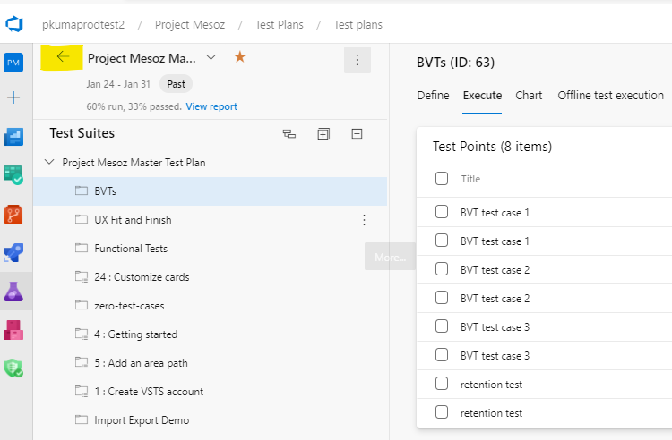

2. Select New Test Plan
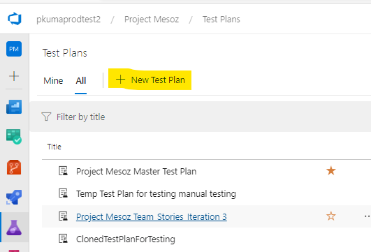

3. Give a name for the test plan, select an area path and iteration and click on Create
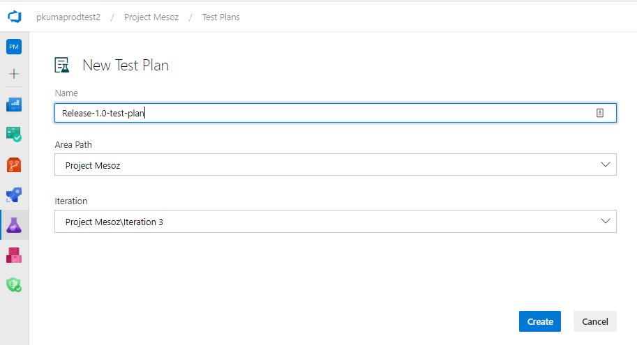

4. You will be navigated to the newly created test plan
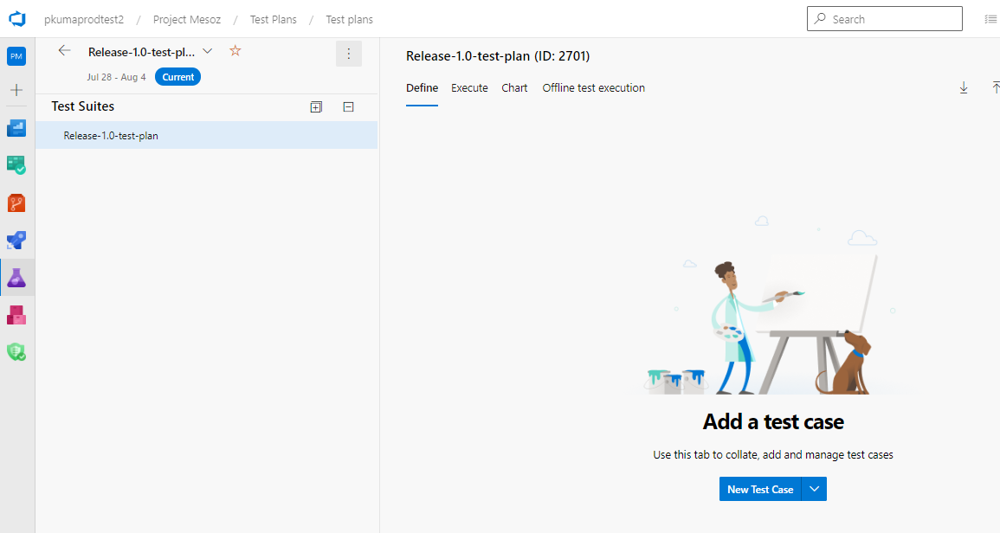

##### Create and organize test suites
1. In the empty test plans page, go to the root suite Release-1.0-test-plan, open the context menu and select New Suite -> Static suite
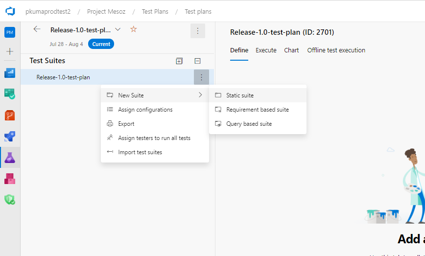

2. Name the Suite as BVT and press enter

3. You can create more test suites and organize them in a folder hierarchy based on your scenario.

4. If you have user stories in your project you can try selecting the Requirement based suite option and create a test suite to track the quality of the user story

##### Create test cases
1. Select the BVT test suite that we created above

2. Click on the new test case option to open the test case form
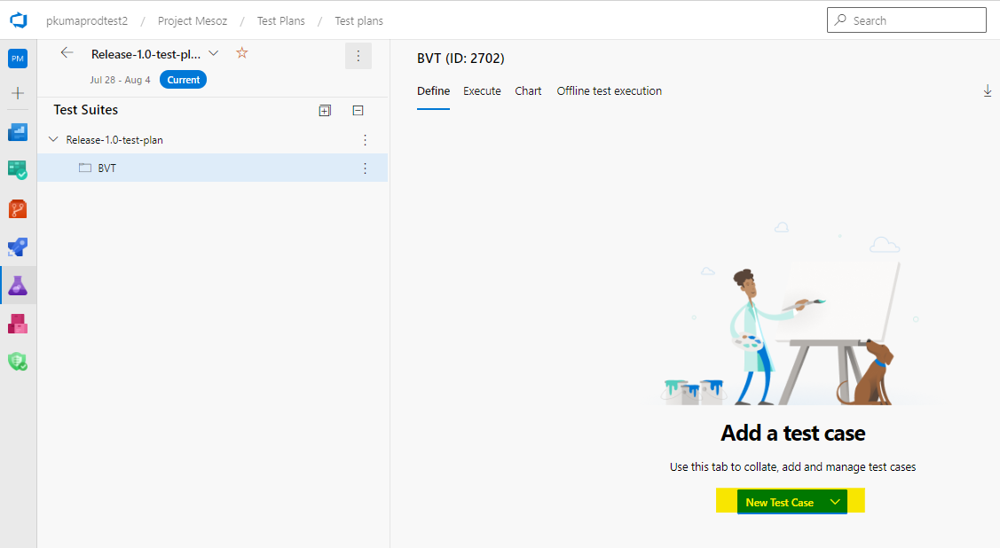

3. Add a few test steps and click on save and close
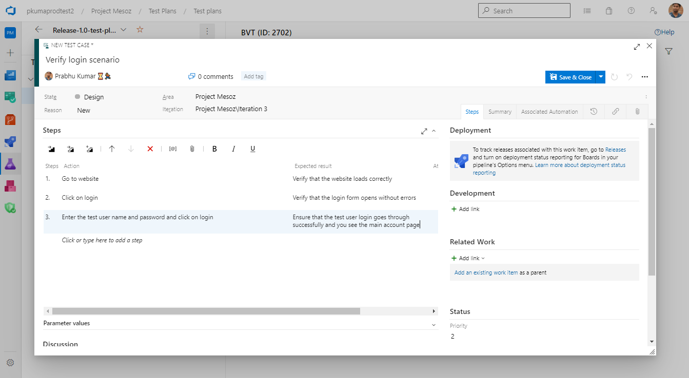

4. You should now see one test case listed in the define tab
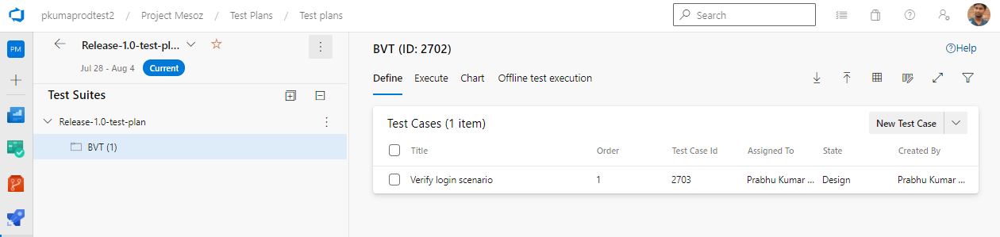

5. If you navigate to the execute tab, you will see that I have two entries for test point; one each for Windows 10 and Mac configurations. Your view here may vary depending on the number of configurations you have in your project.
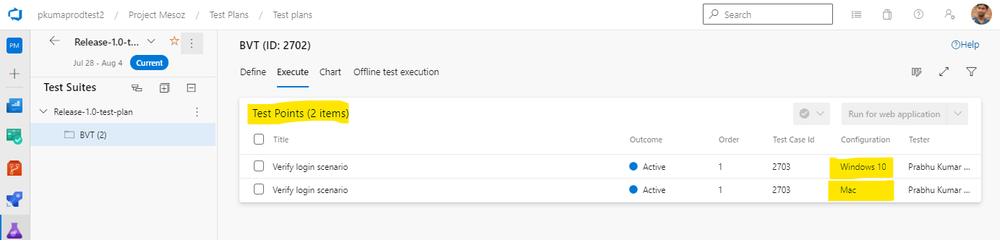

##### Run manual tests using web runner
1. Go to the Execute tab and select the BVT suite

2. Select both the test points and click on Run for web application
insert image

3. This will launch the web runner in a new window and show the steps of the test case
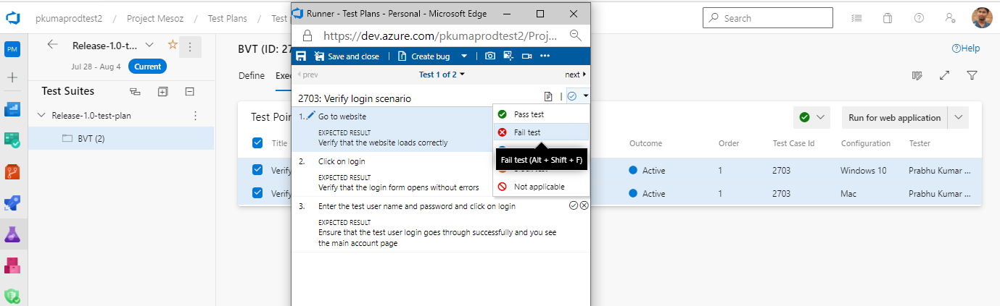

4. You can mark the test case and the individual steps as Pass, Fail, Pause, Block and Not applicable. Let's mark this test case as fail.
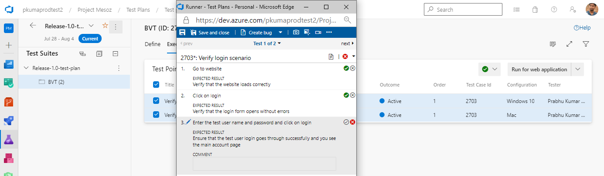

5. Click on Create bug option to create a bug to track a defect for this failed test case. Click on Save and close after adding details to the bug.
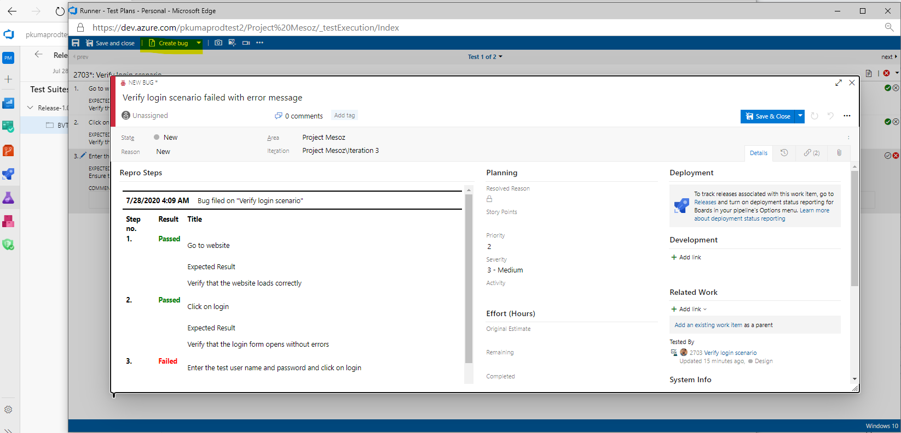

6. Click on Next to go to the next test point
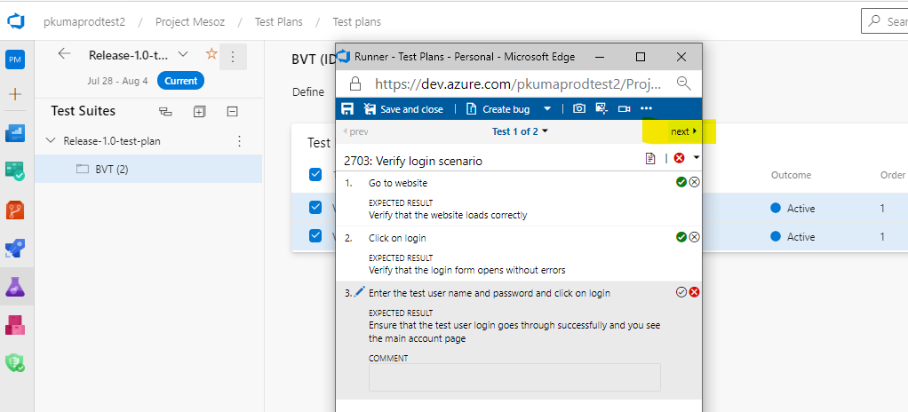

7. Mark the second test point as Pass

8. Click on Save and close on the web runner. This will close the web runner window.
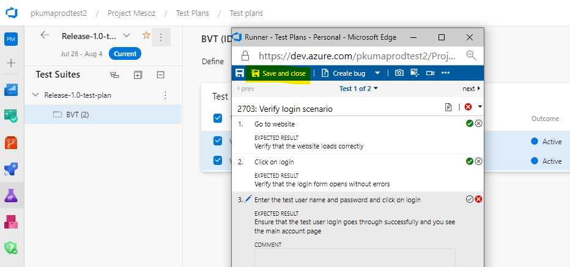

9. You will now see the outcome of the test ~~case~~ points
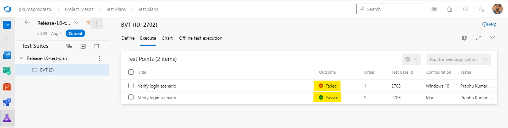 

10. Let's now use the point context menu to mark the failed test point as passed. In the execute tab, open the context menu on the failed test point and select Mark outcome -> Pass
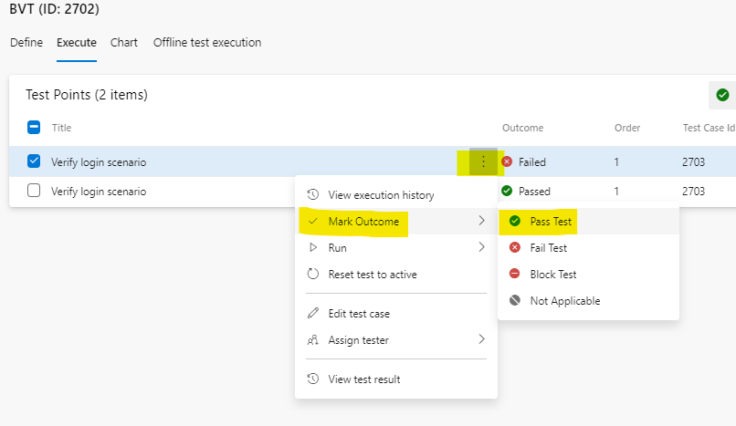

11. The outcome of the failed test point should now change to Pass

12. Now, let's look at the execution history of the first test point. Open the context menu on the test point and select View execution history
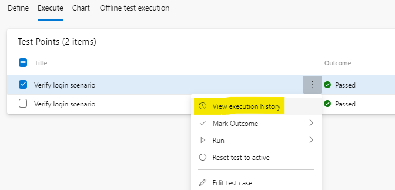

13. This will open a side panel that shows the execution history of the test case associated with the test point
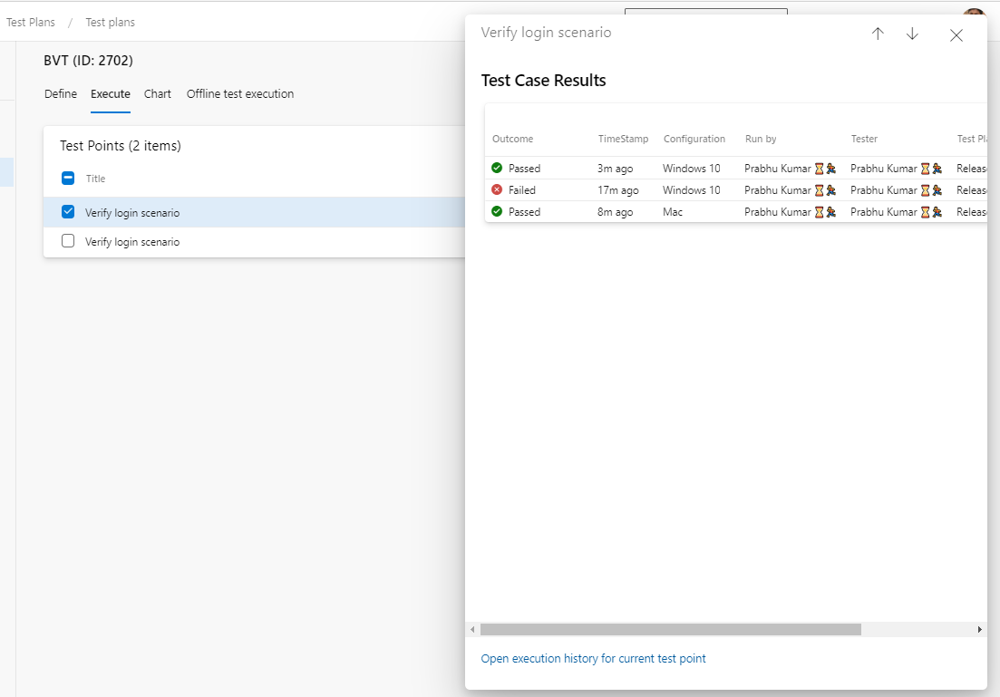

