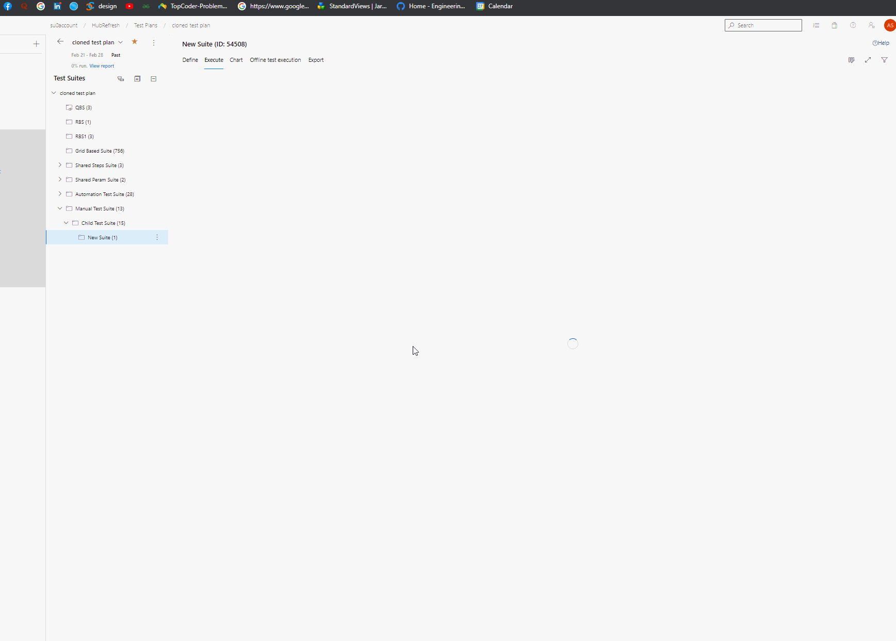
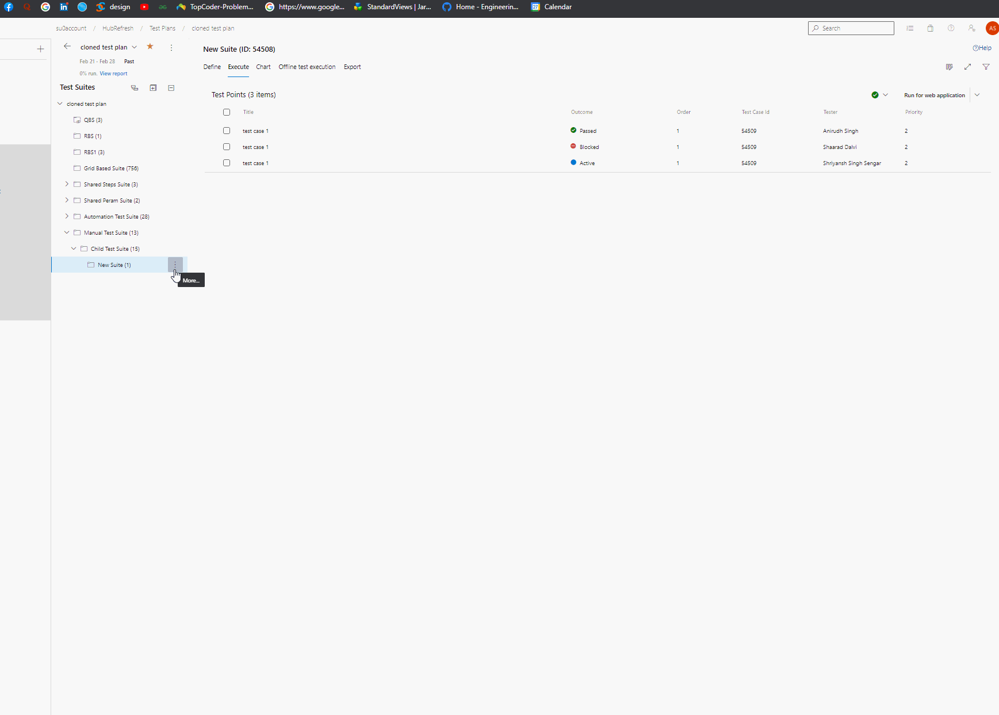
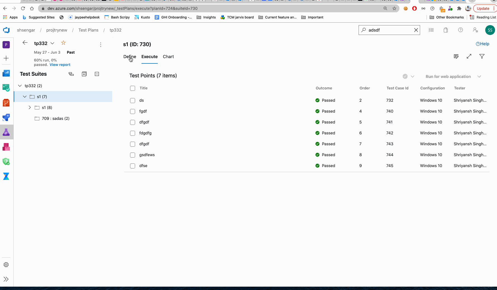

Common User Scenarios KB

## Common user scenarios that are undocumented, for easy reference.

### Test Point Status in **Execute** tab:
Customer often gets confused that they have lost the results or active test points are showing as passed failed etc after assigning tester or configuration. Below are the scenarios which might have caused that state and also the reason behind it-

1) Test point is a combination of test case with tester and configuration. Assigning n testers from "Assign testers to run all tests" option will create n times test points.

 

2) If some testers are removed later, test points corresponding to those testers are marked as inactive and not shown in the execute tab. If later that tester is again assigned, then new test point is not created. Only existing inactive test point is marked as active and shows up on execute tab with the same outcome.

3) Same logic is valid for configuration, if configuration is assigned back for which inactive test points already exist then those test points will just be mark back as active with the same old outcome.

4) Same thing can happen from define tab as well. If we change the configuration for test cases (windows10 -> config2 in below gif) from define tab, the new test points gets created, and marked points become inactive and are not shown. But when we again go back to old configuration (windows10), those inactive points again become active and old execution state is displayed.

 

### Copy test cases
- Supported only if the target suite is a static suite. (Doesn't work if we try to copy test cases to an RBS or QBS)

### Importing Requirements Based Suites
- If RBS is imported to another suite from the UI, the type gets changed to Static Suite.
- To keep the imported test suite as RBS, APIs can be used and the documentation is [here](https://docs.microsoft.com/en-us/rest/api/azure/devops/testplan/test%20suite%20clone/clone%20test%20suite?view=azure-devops-rest-6.1#cloneoptions). While using this API, remember to set the `cloneRequirements` boolean to `true`. Doing this will keep the requirement-based suite as it is.
  - Cloning the requirement does not create a duplicate requirement work item. When you keep the `cloneRequirements` boolean as `true` while making the API call, a new requirement-based suite gets created referencing the same requirement-based work item.
  - Also, test cases are also referenced while cloning and if you want to create separate copies of those test cases, you can set `deepClone = true`, while making the API call.

