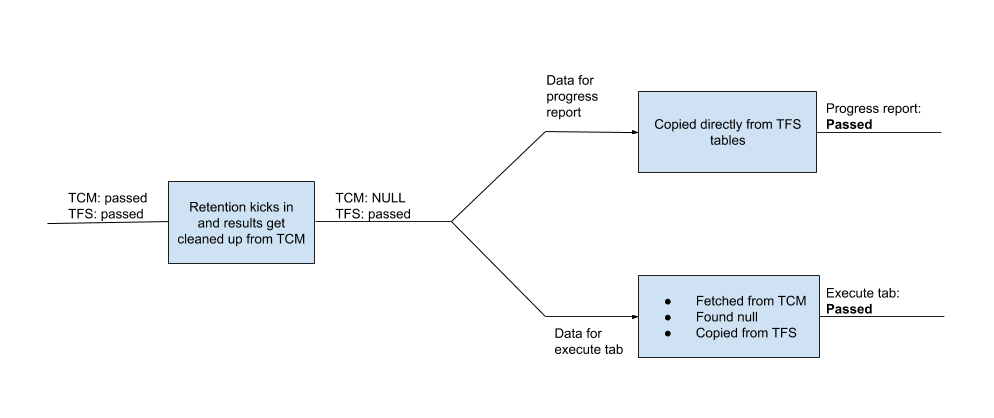
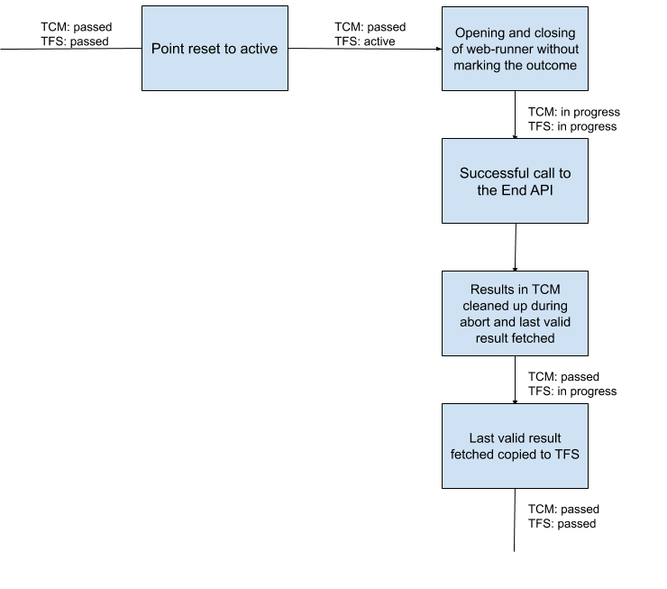

Since around Feb/Mar 2020, we started getting a number of tickets where there was some inconsistency between: 
   1. Charts and Execute tab
   2. Progress Report and Charts 
   3. Execute tab and Progress Report 

## Possible reason for the sudden increase in the number of data discrepancy issues: 

Most of the cases that we observed were reported only by a few customers. However, the first type of discrepancy, i.e., **between Charts and Execute tab/Progress report**, was reported by many users. So, this is something we needed to figure out as to why it started happening suddenly. 

- We fetch the data for the UI from two services namely TFS and TCM. One thing to note is that the dual-write feature for writing results both in TCM and TFS was implemented sometime during April 2019. 
 
- Since the default retention period for keeping test runs and results is 1 year, exactly after 1 year, retention started kicking in for all the users, who were using the default retention settings. 
 
- This created inconsistencies in point results data between TFS and TCM, which is discussed in details later. 

- This is the only possible reason we can think of for the sudden increase in the number of discrepancy issues. 

## Opening and closing of the web-runner: 
Before discussing all the scenarios and their fixes in details, let us first understand the major functions carried out from the opening of the web-runner to its closing. 

- The user action to launch the web-runner triggers the creation of 'in progress' test runs, both in TFS and TCM. 

- Whenever the user marks an outcome, the results corresponding to these test runs are updated to show the latest outcome. 

- However, due to some reasons, if the outcome is not marked and the web-runner is closed, these runs and results need to be deleted or overwritten by the last test run, in order to show the last valid outcome. 

- Upon closing of the web-runner without marking the outcome, **the deletion (or overwriting) takes place in 2 steps**: 

  - The 'End' API is called, which first fetches the latest result associated with the test run from TCM and checks whether the result was completed or not. This is done to make sure whether deletion is required or not. 

  - If deletion is required, an abort function is called with the run id and the fetched results to perform the required operations. In TCM, the 'in progress' runs and results are deleted and the previous outcome is copied back and the same is overwritten in TFS.

## Now, let us discuss every scenario in detail and understand how they were fixed:  

### Scenario 1: Discrepancy between Charts and Execute tab/Progress Report 

#### Reason:
This issue came up for users when the **retention** period for keeping test results (default 365 days) completed. The problem was due to the results getting cleaned from TCM due to retention kicking in but staying as it is in TFS. This causes discrepancy between progress report(gets data from TFS) and charts(gets data from TCM). In addition to that, though execute tab fetches outcome data from TCM, when it receives NULL results from TCM, it used to send outcomes returned from TFS in API responses, causing execute tab to also show TFS data. 

  
 
#### Fix:
This was fixed in two steps. 

- In the First step (AT layer), to fix data shown on execute tab, we stopped using outcomes from TFS, **when we received NULL values from TCM and returned NULL itself instead**. 

- In the second step (DB layer) (Overwrite TFS), we made a change to **start writing NULL values in TFS DB when we received NULL from TCM**. This results in an on-demand clean-up of the results from TFS that were already cleaned up from TCM, due to retention. This fixed the data shown on progress reports. 

	- This would remove mistmatch between TCM and TFS whenever execute tab is loaded, and progress report would be in sync with execute tab and charts.
	
	- This would not be a performance issue since this is a one time thing only for points returning NULL from TCM.

#### Drawbacks of our approach:

- We are fixing data in TFS on demand (whenever execute tab is loaded) (This method was finalized considering that cleaning up TFS table as part of TCM clean up job will be a bigger effort(since it will require a cross service communication)).

-   We will be setting the result outcome to NULL in TFS but last updated time would be current UTC(when user loads the execute tab) and not the time when the run was deleted from TCM table.
 
### Scenario 2: Discrepancy between Progress Report and Charts/Execute tab 
 
#### Case 1
#### Reason: 
##### When the web-runner fails to launch due to some reasons like blocked popups, etc. or was closed before it was completely loaded -

- As explained above, even in this case, due to the user action to launch the web-runner, a new 'in progress' test run is created for the test point, which needs to be cleared in order to show the last valid outcome. 
 
- However, in this case, instead of calling the 'End' API, **a direct call is made to the 'Abort' API**, with just the run id as payload. 
 
- Due to the missing result parameter to the API, which is usually sent through the 'End' API flow, the deletion takes place only in TCM but not in TFS, as in TFS we send the old valid result from TCM to overwrite the 'in progress' one. 

#### Fix:
In the abort function, a change was made to fetch the latest results from TCM, if they were not provided.  
 
This ensures that we get the valid outcome copied to TFS table too. 

#### Case 2
#### Reason:
##### Update result analysis flow (result summary page)- 
 
- This flow is used by a user to add comments to a result to be able to review it later. 
 
- In case, the user tries to add comments to some older result, there can be discrepancies in 2 ways: 

  - **When the comment for a single result is updated**: The newer result is overwritten in the TFS table and not in the TCM table. 

  - **When the comment for multiple results are updated in the same call**:  This overwrites the newer results in TCM tables but not in the TFS tables. 

- The difference in the two flows is based on the payload we send in the API call and also the sproc being used to make updates in TCM tables: 

  - In the first case, **the payload has the plan id**, which causes the point to be updated in TFS tables but some checks in the TCM sproc prevent changes in the TCM tables. 

  - In the second case, **the plan id is set to 0 in the payload**, which prevents changes to TFS tables but there are no checks in the TCM sproc being used and hence, results are overwritten in TCM tables.
 
#### Fix:
- The first scenario of single test result analysis can be taken care of, **by removing the plan id from the request payload**, since it is not required to update the comment. The second scenario would require some other changes, which haven't been thought of yet. 
 
- Since this was reported only by one customer and updating the comment of an older test result was a highly unlikely case, **we have added it to our knowledge base to be addressed later, if we get more similar queries**. 

#### Case 3
#### Reason:
##### When a manual outcome is marked for a test point whose automated run is in progress - 

- The most common scenario where this can happen is when there are more than 1 points being executed by a single automated run. 
 
- Consider  a case where 2 different test points are executed by a single automated test run. 

  - Suppose, **the execution for the first point, say P1, completes and the execution for the second point, say P2, is in progress**. 

  - Now, **if the point P1 is marked manually**, its latest outcome should be the manual one. 

  - However, when the execution for P2 completes, **both the automated results are copied into the TCM table**, not taking into account the completed timestamp for the automated result of P1, although it was less than that of the manual run. 

  - But the sync job, which is responsible for fetching automated results from TCM to TFS, considers the completed timestamp for the automated run and shows the correct outcome. 

- Thus, in this scenario, TFS table has the correct outcome for the test points, whereas, TCM table has the incorrect outcome for one of the test points. 

#### Fix:
- This was fixed by a change made to the sprocs, responsible for copying the outcomes to TCM table, upon run completion. 
 
- After this fix, outcomes were copied to TCM table only after comparing the completed timestamp in TestResults table with the last updated timestamp in TCM table. 
 
- **Regression**: The above fix resolved the issue but caused another regression, which caused Charts and Execute tab to go out of sync. 
 
  This regression was observed when this change was deployed on TCM ring 0 and a customer tried to mark the outcomes of test points manually, without launching the web-runner. 
 
  However, in the end, in order to address the new issue, we had to revert the original fix and think of a new fix for the same. 

  After a few rounds of discussion, we reached with a solution to the problem but that required more sproc changes. So, we came to a decision to not go ahead with the changes until we received more feedbacks for similar issues, as this was also reported by only one customer and is sort of a one-off scenario. 

#### Case 4
#### Reason:
#### When a point has simultaneously executed runs

- A run is started for a test point (runId r1). Before this test point execution is completed, another run with runId r2 is created for this point. So we have r2 > r1. If r2 completes before r1 with outcome1, and later r1 completes with outcome2. Execute tab and charts will show outcome1(outcome from greatest runId) while progress report will show outcome2 (outcome based on last completed time stamp).  

- Most likely scenario for this to occur is when a particular point was attempted to be executed using web runner, but before saving and closing this, the same point was also marked with outcome from UI / using update test points API. In this case, outcome marked in UI shows up in execute tab and charts but progress report would show outcome marked in web runner. Or when multiple testers are executing the same point and causing simultaneous runs to exist for the same point.

- This will happen when execution is done from UI and not when done from rest APIs.

#### Fix:
Currently working on fix for this scenario. The issue arises since TFS contains last received outcome, while TCM returns the outcome for a points based last executed run. Working towards ensuring TCM also returns outcome based on completed time stamp.   

### Scenario 3: Discrepancy between Execute tab and Progress Report/Charts 

#### Reason:
##### When the web-runner is opened and closed for a test point previously reset to active state - 

- Whenever a test point is reset to active, the active state of the test points is saved only in TFS table and not in the TCM tables. This was the major cause of this discrepancy. 

- Suppose, **at time T1, a point P1 was provided with an outcome, say passed**. This outcome gets saved both in TFS and TCM. Now, **at time T2, the point was reset to active**. 

- Due to this, the last valid outcome in the TCM tables show the point as passed. 

- Now, **at time T3, the point is opened in web-runner and closed without marking any outcome**. 

- If we recall the cleanup of the 'in progress' results, **we fetch the last valid outcome from TCM and copy that into TFS**, which makes the points to get marked as passed as at T1, instead of marking them as active, as at T2. 

- **While fetching the data for execute tab, we used to take into account the last reset to active timestamp, which helped us show the correct active state there**. However, this logic was not included in Charts and Progress Report, due to which they kept showing the points as passed. 

#### Fix:
- The first change was to add a check while copying the previous outcome from TCM to ensure that the point was not reset to active after the completion of the previous result. This fixed the issue with Progress Reports. 

- The second change was to take into account the last reset to active timestamp while fetching data for Charts.

 

 
