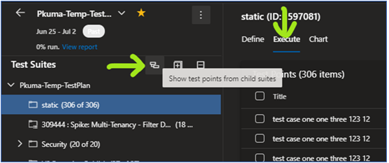

#### Azure Test Plans - Show Test Points from Child Suites
In the new Test Plans UX, you can now see all the test points from child suites. To use this feature, go to the 'Execute' tab and you should see the below icon just above the suite tree,

