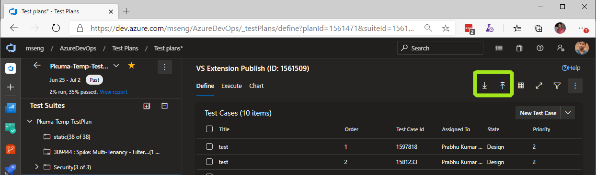

### Test case import and export using CSV

We are very excited to release the import/export feature for test cases in early preview! This preview will also enable us to get early feedback and address any major issues or bugs. Please read on to find details about how you can opt-in to this feature, where can you report bugs etc.  

#### How do I opt-in to this feature?  
To opt-in to import/export, send us an e-mail at [importexporthelp@microsoft.com](mailto:importexporthelp@microsoft.com?subject=Import/export%20feature%20enable%20request&body=My%20Azure%20DevOps%20Organization%20name%20is:). Please ensure you **include your Azure DevOps organization name in the email**. We will reply back to you as soon as the feature is enabled on your organization.  

#### Where do I report issues or bugs?  
To report issues, bugs or any other suggestions, you can again write to us at [importexporthelp@microsoft.com](mailto:importexporthelp@microsoft.com?subject=Import/export%20bug%20report&body=<Please%20provide%20detailed%20description%20of%20the%20issue%20and%20attach%20the%20CSV%20file%20if%20you%20can>)

#### Feature description
You will find the import/export option in the ```Define``` tab in the new Test Plans experience, as shown below.
  
  
The ```Down``` arrow lets you export the test cases in the current suite into a CSV file and save it on disk. The ```Up``` arrow lets you upload a CSV file and import the test cases in to the currently selected suite. Currently, all the test cases within a Suite get exported and selecting only a subset of the test cases has no effect. We are looking to add support to export only selected test cases in a future update.

#### How do I add or import new test cases to a suite?
By importing a CSV file where the first column ```ID``` field is blank, you can create new test cases. The easiest way to do this is to export test cases, edit them in excel, make sure you delete the ID column value and leave it blank and import this CSV file into a suite. The ```ID``` column denotes the test case id. If the ID column contains a valid test case ID, then the test case will get updated.

#### How do I see other fields or columns when I export?
By default we export all the columns that are visible currently in the suite. If you want to see the new field in CSV, you can choose that ```Column option``` in the suite and then perform the export.

#### How do I export all my test cases from a project?
Since we export all test cases from the current suite this is currently not possible. But there is a work around!  

You can create a new Query based suite in a test plan, modify the query as per your requirement; wait for the test cases to load in the new QBS and then export them all. Although you can use this work around to export all the test cases in a team project, we would highly recommend for you to use as specific a query as possible. If your query returns a large number of test cases (in the range of couple of thousands) then the performance of the page will get degraded. **If you created the QBS temporarily to export the test cases, make sure you delete the Query based suite!**  

## What is not supported?  
- Shared steps in test cases is not supported. **WARNING: If your test cases contain shared steps, then exporting and importing the test case may cause you to lose test case steps.**
- Retaining formatting of the test steps is not supported. **WARNING: If you rely on the test step formatting, then exporting-importing will make you lose the formatting!! Please do not use the import/export feature in this case.**
- Local parameters and Shared Parameters in a test case are not supported while exporting or importing.
- Graceful error handling and data validation is not supported. This is work in progress and will get better with future updates.
- Delete operation is not supported. If you delete or remove a test case from CSV and import it; the test case will not get deleted from the suite or team project.
- When creating new test cases via importing, you must set the state of the test case to ```Active```. Other state values during test case creation are not supported.  

Feel free to reach out to use at [importexporthelp@microsoft.com](mailto:importexporthelp@microsoft.com?subject=Import/export%20suggestions%) for any suggestions or feedback.  